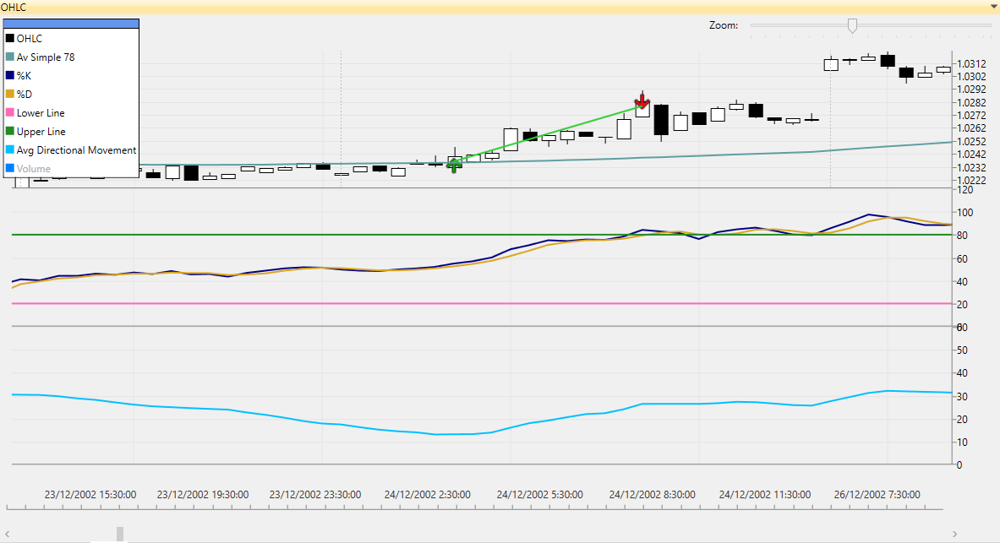
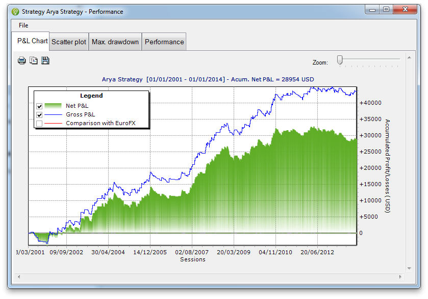

Arya Trading Strategy
============================================

Table of Contents
----

* [Overview](#overview)
* [Arya Trading Rules](#Arya-trading-rules)
* [Download](#download)
* [Quick Start](#quick-start)
* [User Manual](#user-manual)
* [About iSystems](#about-isystems)
* [Disclaimer](#disclaimer)

Overview
----

Arya is a trading algorithm written in C# using the [TradingMotion SDK] development tools (there is a [VB.net] port too).


<sub>__Image footnote:__ Example of Arya OHLC financial chart showing some automatic trades</sub>

The strategy code is all contained in [AryaStrategy.cs], including a default parameter combination.

This default parameter combination has been optimized to run over 60' bars of _EUR/USD currencty Future_.

Trading a maximum of 1 contract of EuroFX Future, this is how performed (hypothetically) from 2001 to 20014:


<sub>__Image footnote:__ Hypothetic Net P&L chart for Arya strategy</sub>

Anyway, go open Visual Studio, clone the project and start with the trading algo development! Sure you can do better and improve all these figures :)

Arya Trading Rules
----

Arya's trading plan is quite simple. It __buys 1 contract__ when the price breaks above a specified Stochastic %D's level, or __sells 1 contract__ when the price breaks below a lower Stochastic %D's level.

While Arya has a position in the market, it __places two exit orders__. A _Trailing Stop_ order (keep locking profits while price is moving in our favor), and a _Take Profit_ (close the position with a profit). 

Besides, Arya is a pure __intraday strategy__. That means it won't leave any open position at the end of the session, so in case we still got a position it will be closed automatically.

Last but not least, Arya uses __4 entry filters__ to avoid entering the market in bad conditions:
* _Day of week_: Arya won't trade on specific days of the week (ex. don't trade on fridays)
* _Session Time_: set the time frame where Arya is allowed to place entries (ex. from 10:15 to 12:30 only)
* _Volatility (range)_: Arya won't place entries if current volatility range is under a specific treshold
* _Trend Strength_: Arya won't place entries if current trend strength is under a specific treshold (Trend strength is measured using [ADX technical indicator])
* _Underlying Trend_: Arya won't place long entries if current underlying trend is considered bearish (and the other way around). Underlying Trend is considered bearish if the [Exponential Moving Average] is decreasing, and bullish if is rising.

### To sum up ###
```
Arya Trading Strategy rules:

  * Entry: Price breaks a Stochastic's %D long or short levels
  * Exit: Set a Trailing Stop and a Take Profit
  * Filters (sets the entry only under certain conditions):
     -Day of week
     -Session Time
     -Volatility (Range)
     -Trend strenght (ADX)
     -Underlying Trend (Exponential Moving Average)
```

### Show me the code ###

Here is a simplified C# source code of Arya's _OnNewBar()_ function. The complete code is all contained in [AryaStrategy.cs] along with comments and definition of parameters.

```csharp
decimal buySignal = (decimal)this.GetInputParameter("Trend-following buy signal");
decimal sellSignal = (decimal)this.GetInputParameter("Trend-following sell signal");

decimal stopMargin = (int)this.GetInputParameter("Trailing Stop Loss ticks distance") * this.GetMainChart().Symbol.TickSize;
decimal profitMargin = (int)this.GetInputParameter("Profit Target ticks distance") * this.GetMainChart().Symbol.TickSize;

bool longTradingEnabled = false;
bool shortTradingEnabled = false;

// Day-of-week filter
if (IsDayEnabledForTrading(this.Bars.Time[0].DayOfWeek))
{
    // Time-of-day filter
    if (IsTimeEnabledForTrading(this.Bars.Time[0]))
    {
        // Volatility filter
        if (CalculateVolatilityRange() > (decimal)this.GetInputParameter("Minimum Range Filter"))
        {
            // ADX minimum level and current trending filters
            if (this.GetOpenPosition() == 0 && IsADXEnabledForLongEntry() && IsBullishUnderlyingTrend())
            {
                longTradingEnabled = true;
            }
            else if (this.GetOpenPosition() == 0 && IsADXEnabledForShortEntry() && IsBearishUnderlyingTrend())
            {
                shortTradingEnabled = true;
            }
        }
    }
}

if (longTradingEnabled && stochasticIndicator.GetD()[1] <= buySignal && stochasticIndicator.GetD()[0] > buySignal)
{
    // BUY SIGNAL: Stochastic %D crosses above "buy signal" level
    MarketOrder buyOrder = new MarketOrder(OrderSide.Buy, 1, "Enter long position");
    this.InsertOrder(buyOrder);

    trailingStopOrder = new StopOrder(OrderSide.Sell, 1, this.Bars.Close[0] - stopMargin, "Catastrophic stop long exit");
    this.InsertOrder(trailingStopOrder);

    profitOrder = new LimitOrder(OrderSide.Sell, 1, this.Bars.Close[0] + profitMargin, "Profit stop long exit");
    this.InsertOrder(profitOrder);

    // Linking Stop and Limit orders: when one is executed, the other is cancelled
    trailingStopOrder.IsChildOf = profitOrder;
    profitOrder.IsChildOf = trailingStopOrder;

    // Setting the initial acceleration for the trailing stop and the furthest (the most extreme) close price
    acceleration = (decimal)this.GetInputParameter("Trailing Stop acceleration");
    furthestClose = this.Bars.Close[0];
}
else if (shortTradingEnabled && stochasticIndicator.GetD()[1] >= sellSignal && stochasticIndicator.GetD()[0] < sellSignal)
{
    // SELL SIGNAL: Stochastic %D crosses below "sell signal" level
    MarketOrder sellOrder = new MarketOrder(OrderSide.Sell, 1, "Enter short position");
    this.InsertOrder(sellOrder);

    trailingStopOrder = new StopOrder(OrderSide.Buy, 1, this.Bars.Close[0] + stopMargin, "Catastrophic stop short exit");
    this.InsertOrder(trailingStopOrder);

    profitOrder = new LimitOrder(OrderSide.Buy, 1, this.Bars.Close[0] - profitMargin, "Profit stop short exit");
    this.InsertOrder(profitOrder);

    // Linking Stop and Limit orders: when one is executed, the other is cancelled
    trailingStopOrder.IsChildOf = profitOrder;
    profitOrder.IsChildOf = trailingStopOrder;

    // Setting the initial acceleration for the trailing stop and the furthest (the most extreme) close price
    acceleration = (decimal)this.GetInputParameter("Trailing Stop acceleration");
    furthestClose = this.Bars.Close[0];
}
else if (this.GetOpenPosition() == 1 && this.Bars.Close[0] > furthestClose)
{
    // We're long and the price has moved in our favour
    furthestClose = this.Bars.Close[0];

    // Increasing acceleration
    acceleration = acceleration * (furthestClose - trailingStopOrder.Price);

    // Checking if trailing the stop order would exceed the current market price
    if (trailingStopOrder.Price + acceleration < this.Bars.Close[0])
    {
        // Setting the new price for the trailing stop
        trailingStopOrder.Price = trailingStopOrder.Price + acceleration;
        trailingStopOrder.Label = "Trailing stop long exit";
        this.ModifyOrder(trailingStopOrder);
    }
    else
    {
        // Cancelling the order and closing the position
        this.CancelOrder(trailingStopOrder);
        this.CancelOrder(profitOrder);

        MarketOrder exitLongOrder = new MarketOrder(OrderSide.Sell, 1, "Exit long position");
        this.InsertOrder(exitLongOrder);
    }
}
else if (this.GetOpenPosition() == -1 && this.Bars.Close[0] < furthestClose)
{
    // We're short and the price has moved in our favour
    furthestClose = this.Bars.Close[0];

    // Increasing acceleration
    acceleration = acceleration * Math.Abs(trailingStopOrder.Price - furthestClose);

    // Checking if trailing the stop order would exceed the current market price
    if (trailingStopOrder.Price - acceleration > this.Bars.Close[0])
    {
        // Setting the new price for the trailing stop
        trailingStopOrder.Price = trailingStopOrder.Price - acceleration;
        trailingStopOrder.Label = "Trailing stop short exit";
        this.ModifyOrder(trailingStopOrder);
    }
    else
    {
        // Cancelling the order and closing the position
        this.CancelOrder(trailingStopOrder);
        this.CancelOrder(profitOrder);

        MarketOrder exitShortOrder = new MarketOrder(OrderSide.Buy, 1, "Exit short position");
        this.InsertOrder(exitShortOrder);
    }
}
```

Download
----

First of all, make sure you have Visual Studio 2010 version (or higher). [TradingMotion SDK] is fully compatible with [Visual Studio Express] free versions.

Download TradingMotion [Visual Studio extension], and the windows desktop application [TradingMotionSDK Toolkit installer].


Quick Start
----

* Create a free account to access TradingMotionAPI (required). It can be created from TradingMotionSDK Toolkit (the desktop application)
* Clone the repository:
```sh
git clone https://github.com/victormartingarcia/Arya-trading-strategy-csharp
```
* Open Visual Studio and load solution _AryaStrategy/AryaStrategy.sln_
* Edit _app.config_ file adding your TradingMotionAPI credentials on _appSettings_ section

And you're all set!

Running the project (F5) will perform a _development backtest simulation_ over last 6 months DAX 60' bars data.

Once it has finished, it will ask if you want to see the P&L report in TradingMotionSDK Toolkit. Pressing 'y' will load the same backtest with the desktop app, where it will show performance statistics, charts, and so on.

User Manual
----

__[More documentation in the Getting Started Guide]__

About iSystems
----

[iSystems] by [TradingMotion] is a marketplace for automated trading systems.

_iSystems_ has partnered with [11 international brokers](http://www.tradingmotion.com/Brokers) (and counting) that offer these trading systems to their clients (both corporate and retail) who pay for a license fee that the developer charges.

The trading systems run with live market data under a controlled environment in iSystems' datacenters.

This way the developers just need to worry about how to make their trading systems better and iSystems platform does the rest.

Visit [Developers] section on TradingMotion's website for more info on how to develop and offer your systems.

Disclaimer
----

I am R&D engineer at [TradingMotion LLC], and head of [TradingMotion SDK] platform. Beware, the info here can be a little biased ;)

  [VB.net port]: https://github.com/victormartingarcia/Arya-trading-strategy-vbnet
  [TradingMotion SDK]: http://sdk.tradingmotion.com
  [AryaStrategy.cs]: AryaStrategy/AryaStrategy.cs
  [iSystems platform]: https://www.isystems.com
  [iSystems.com]: https://www.isystems.com
  [iSystems]: https://www.isystems.com
  [TradingMotion LLC]: http://www.tradingmotion.com
  [TradingMotion]: http://www.tradingmotion.com
  [Developers]: http://www.tradingmotion.com/Strategies/Developers
  [Visual Studio Express]: http://www.visualstudio.com/en-us/downloads#d-2010-express
  [TradingMotion SDK website]: http://sdk.tradingmotion.com
  [TradingMotionSDK Toolkit installer]: http://sdk.tradingmotion.com/files/TradingMotionSDKInstaller.msi
  [Visual Studio extension]: http://sdk.tradingmotion.com/files/TradingMotionSDK_VisualStudio.vsix
  [More documentation in the Getting Started Guide]: http://sdk.tradingmotion.com/GettingStarted
